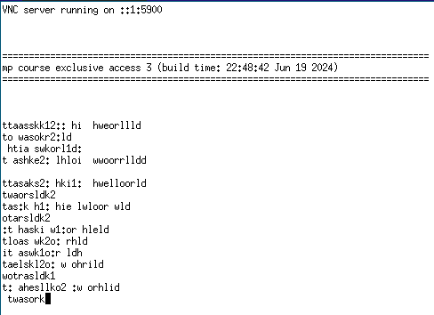

# mp_course_ex0716_exclusive_access-_4

## mp_course_ex0716_exclusive_access_netduinoplus2_baremetal_qemu

### Debug

```as
29          ldr     r1, =lock_flag_addr_1
(gdb) p/x (int)lock_flag_addr_1
$1 = 0x0
```

```as
34          mov     r2, #1          @ load the ‘lock flag taken’ value (0: free, 1: lock)
(gdb) n
try1 () at /home/rewls/git/ubiworks/library/mp_course_materials/app/mp_course_ex0716_exclusive_access/appmain.S:36
36          ldrex   r0, [r1]        @ load the lock flag value
(gdb)
37          cmp     r0, #0          @ is the lock flag free?
(gdb) p/x $r0
$2 = 0x0
(gdb) n
38          itte    eq
(gdb)
39          strexeq r0, r2, [r1]    @ try and claim the lock (success -> r0 = 0, fail r0 = 1)
(gdb)
40          cmpeq   r0, #0          @ did this succeed?
(gdb) p/x $r0
$3 = 0x0
(gdb) p (int)lock_flag_addr_1
$4 = 1
```

```as
51          mov     r2, #1          @ load the ‘lock flag taken’ value (0: free, 1: lock)
(gdb) n
52          mov     r3, #1
(gdb)
try2 () at /home/rewls/git/ubiworks/library/mp_course_materials/app/mp_course_ex0716_exclusive_access/appmain.S:54
54          cmp     r3, #0
(gdb)
55          beq     done2
(gdb)
56          ldrex   r0, [r1]        @ load the lock flag value
(gdb)
57          svc     #15             @ <- execute other
(gdb)
SVC_Handler () at /home/rewls/git/ubiworks/library/mp_course_materials/app/mp_course_ex0716_exclusive_access/appmain.S:100
100         bx      lr
(gdb)
try2 () at /home/rewls/git/ubiworks/library/mp_course_materials/app/mp_course_ex0716_exclusive_access/appmain.S:58
58          mov     r3, #0
(gdb)
59          cmp     r0, #0          @ is the lock flag free?
(gdb)
60          itte    eq
(gdb)
61          strexeq r0, r2, [r1]    @ try and claim the lock (success -> r0 = 0, fail r0 = 1)
(gdb) p (int)lock_flag_addr_1
$5 = 0
(gdb) n
62          cmpeq   r0, #0          @ did this succeed?
(gdb) p $r0
$6 = 1
(gdb) p (int)lock_flag_addr_1
$7 = 0
(gdb) n
63          bne     try2            @ no, try again
(gdb)
54          cmp     r3, #0
(gdb)
55          beq     done2
(gdb)
done2 () at /home/rewls/git/ubiworks/library/mp_course_materials/app/mp_course_ex0716_exclusive_access/appmain.S:67
67          mov     r0, #0
```

```as
74          mov     r2, #1          @ load the ‘lock flag taken’ value (0: free, 1: lock)
(gdb) n
try3 () at /home/rewls/git/ubiworks/library/mp_course_materials/app/mp_course_ex0716_exclusive_access/appmain.S:76
76          ldrex   r0, [r1]        @ load the lock flag value
(gdb)
77          bl      func_a          @ <- execute other
(gdb) s
func_a () at /home/rewls/git/ubiworks/library/mp_course_materials/app/mp_course_ex0716_exclusive_access/appmain.S:92
92          clrex                   @ <- accessed
(gdb) n
93          bx      lr
(gdb)
try3 () at /home/rewls/git/ubiworks/library/mp_course_materials/app/mp_course_ex0716_exclusive_access/appmain.S:78
78          cmp     r0, #0          @ is the lock flag free?
(gdb)
79          itte    eq
(gdb)
80          strexeq r0, r2, [r1]    @ try and claim the lock (success -> r0 = 0, fail r0 = 1)
(gdb)
81          cmpeq   r0, #0          @ did this succeed?
(gdb) p $r0
$8 = 1
(gdb) p (int)lock_flag_addr_1
$9 = 0
(gdb) n
82          bne     try3            @ no, try again
(gdb)
76          ldrex   r0, [r1]        @ load the lock flag value
```

## mp_course_ex0716_exclusive_access_2_netduinoplus_qemumo

### Source

```c
static void task1_func(void * arg)
{
    unsigned int delayms;

    printf("\n");

    for (unsigned int i = 0; ; i++)
    {
        for (unsigned int j = 0; j < strlen(task1_msg); j++)
        {
            delayms = (rand() % 10 + 1) * 20;
            printf("%c", task1_msg[j]);
            task_sleepms(delayms);
        }
    }
}

static void task2_func(void * arg)
{
    unsigned int delayms;

    printf("\n");

    for (unsigned int i = 0; ; i++)
    {
        for (unsigned int j = 0; j < strlen(task2_msg); j++)
        {
            delayms = (rand() % 10 + 1) * 20;
            printf("%c", task2_msg[j]);
            task_sleepms(delayms);
        }
    }
}
```

- 실행 결과

    

## mp_course_ex0716_exclusive_access_3_netduinoplus_qemumo

### Source

```c
static void task1_func(void * arg)
{
    unsigned int delayms;

    printf("\n");

    for (unsigned int i = 0; ; i++)
    {
        if (lock_flag == 0)
        {
#if (INSERT_DELAY_BETWEEN_CHECK_LOCK_FLAG == 1)
            bsp_busywaitms(2);
#endif
            lock_flag = 1;

            for (unsigned int j = 0; j < strlen(task1_msg); j++)
            {
                delayms = (rand() % 10 + 1) * 20;
                printf("%c", task1_msg[j]);
                task_sleepms(delayms);
            }

            lock_flag = 0;
        }

        task_sleepms(1);
    }
}

static void task2_func(void * arg)
{
    unsigned int delayms;

    printf("\n");

    for (unsigned int i = 0; ; i++)
    {
        if (lock_flag == 0)
        {
#if (INSERT_DELAY_BETWEEN_CHECK_LOCK_FLAG == 1)
            bsp_busywaitms(2);
#endif
            lock_flag = 1;
            
            for (unsigned int j = 0; j < strlen(task2_msg); j++)
            {
                delayms = (rand() % 10 + 1) * 20;
                printf("%c", task2_msg[j]);
                task_sleepms(delayms);
            }

            lock_flag = 0;
        }

        task_sleepms(1);
    }
}
```

- 실행 결과

    

## mp_course_ex0716_exclusive_access_4_netduinoplus_qemumo

### Source

```c
static void task1_func(void * arg)
{
    unsigned int delayms;

    printf("\n");

    for (unsigned int i = 0; ; i++)
    {
        bsp_disableintr();
        if (lock_flag == 0)
        {
#if (INSERT_DELAY_BETWEEN_CHECK_LOCK_FLAG == 1)
            bsp_busywaitms(2);
#endif
            lock_flag = 1;
            bsp_enableintr();

            for (unsigned int j = 0; j < strlen(task1_msg); j++)
            {
                delayms = (rand() % 10 + 1) * 20;
                printf("%c", task1_msg[j]);
                task_sleepms(delayms);
            }

            lock_flag = 0;
        }
        else
        {
            bsp_enableintr();
        }

        task_sleepms(1);
    }
}

static void task2_func(void * arg)
{
    unsigned int delayms;

    printf("\n");

    for (unsigned int i = 0; ; i++)
    {
        bsp_disableintr();
        if (lock_flag == 0)
        {
#if (INSERT_DELAY_BETWEEN_CHECK_LOCK_FLAG == 1)
            bsp_busywaitms(2);
#endif
            lock_flag = 1;
            bsp_enableintr();
            
            for (unsigned int j = 0; j < strlen(task2_msg); j++)
            {
                delayms = (rand() % 10 + 1) * 20;
                printf("%c", task2_msg[j]);
                task_sleepms(delayms);
            }

            lock_flag = 0;
        }
         else
        {
            bsp_enableintr();
        }

        task_sleepms(1);
   }
}
```

- 실행 결과

    

### Debug

```c
(gdb) b task1_func
Breakpoint 2 at 0x8000398: file /home/rewls/git/ubiworks/library/mp_course_materials/app/mp_course_ex0716_exclusive_access_4/appmain.c, line 63.
(gdb) b task2_func
Breakpoint 3 at 0x8000458: file /home/rewls/git/ubiworks/library/mp_course_materials/app/mp_course_ex0716_exclusive_access_4/appmain.c, line 98.
(gdb) c
Continuing.

Breakpoint 2, task1_func (arg=0x0) at /home/rewls/git/ubiworks/library/mp_course_materials/app/mp_course_ex0716_exclusive_access_4/appmain.c:63
63          printf("\n");
(gdb) n
100         for (unsigned int i = 0; ; i++)
(gdb)
102             bsp_disableintr();
(gdb) s
bsp_disableintr () at /home/rewls/git/ubiworks/library/ubinos/source/ubinos/bsp/arch/arm/cortexm/bsp.c:82
82          ARM_INTERRUPT_DISABLE();
83      }
(gdb)
task2_func (arg=0x0) at /home/rewls/git/ubiworks/library/mp_course_materials/app/mp_course_ex0716_exclusive_access_4/appmain.c:103
103             if (lock_flag == 0)
(gdb) n
106                 bsp_busywaitms(2);
(gdb) n
108                 lock_flag = 1;
(gdb)
109                 bsp_enableintr();
(gdb) s
bsp_enableintr () at /home/rewls/git/ubiworks/library/ubinos/source/ubinos/bsp/arch/arm/cortexm/bsp.c:78
78          ARM_INTERRUPT_ENABLE();
(gdb) n
79      }
(gdb)
task2_func (arg=0x0) at /home/rewls/git/ubiworks/library/mp_course_materials/app/mp_course_ex0716_exclusive_access_4/appmain.c:111
111                 for (unsigned int j = 0; j < strlen(task2_msg); j++)
(gdb)
113                     delayms = (rand() % 10 + 1) * 20;
(gdb)
114                     printf("%c", task2_msg[j]);
(gdb)
115                     task_sleepms(delayms);
(gdb)
111                 for (unsigned int j = 0; j < strlen(task2_msg); j++)
(gdb)
113                     delayms = (rand() % 10 + 1) * 20;
(gdb)
114                     printf("%c", task2_msg[j]);
(gdb)
115                     task_sleepms(delayms);
...
(gdb)
118                 lock_flag = 0;
(gdb)
125             task_sleepms(1);
```
